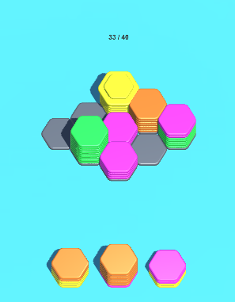
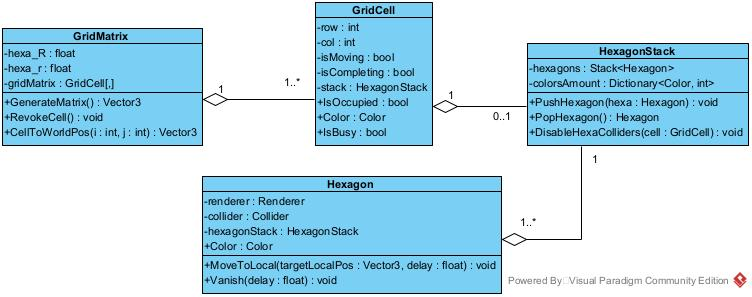
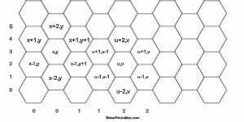
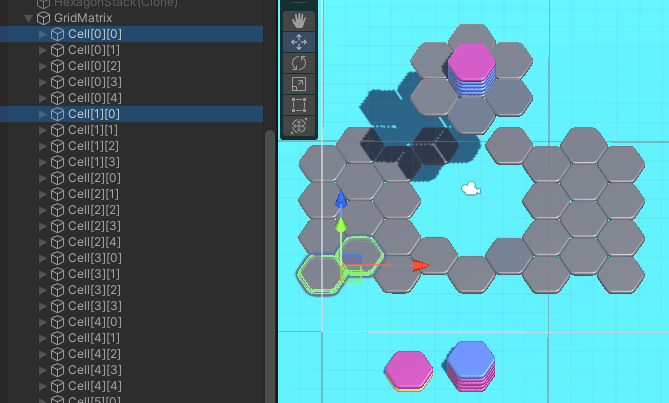
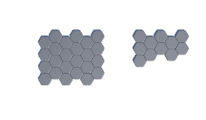

# Giới thiệu cơ bản
- Hexa Sort thuộc thể loại Puzzle
- Gameplay chính được thiết kế xoay quanh việc đặt các stack hexa được sinh ra lên lưới → Ô vừa được đặt stack lên sẽ tìm kiếm hàng xóm theo 6 cạnh của hexa mà có những hexa trên đỉnh stack cùng màu với hexa trên đỉnh stack của nó. Khi đã tìm thấy tất cả hàng xóm sẽ bắt đầu trộn các hexa cùng màu trên đỉnh với nhau theo các tiêu chí được thiết kế. Các stack có sự thay đổi trạng thái sẽ tiếp tục được kiểm tra để trộn với các hàng xóm của nó.

  

# Game Mechanic (Core Loop)
## Action (Core Mechanic)
- Kịch bản chuẩn
	1. Hệ thống tạo ra 1 lưới hexa và sinh ra 3 stack hexa để người chơi có thể kéo thả vào lưới
	2. Người chơi kéo thả 1 trong 3 stack hexa đang chờ để đặt lên lưới
	3. Hệ thống tìm các hàng xóm theo 6 cạnh của hexa tại ô vừa đặt mà có hexa trên đỉnh cùng màu với hexa trên đỉnh của ô vừa đặt
		- Nếu tìm thấy, trộn tất cả các hexa có cùng màu với nhau
		- Nếu trên 1 stack đủ 10 hexa cùng màu trở lên, hệ thống tiến hành loại bỏ các hexa đó khỏi stack
	4. Lặp lại các bước 2 và 3 cho đến khi hết số lượng stack đang chờ, hệ thống tiếp tục sinh ra 3 stack mới
	5. Lặp lại các bước 2, 3, 4 cho đến khi đạt được yêu cầu của level hiện tại.
- Win: Khi người chơi đạt đủ yêu cầu của màn chơi hiện tại
- Loss: 
	- Sau khi người chơi đặt stack lên ô cuối cùng còn trống của lưới, hệ thống tiến hành trộn stack
	- Khi kết thúc tiến trình này mà trên lưới không còn ô trống và người chơi chưa đạt được yêu cầu màn chơi hiện tại.

# Entity Class Diagram
1. Mô tả
	- 1 lưới (ma trận) có nhiều ô
	- 1 ô chứa tối đa 1 stack
	- 1 stack chứa nhiều hexa (ít nhất 1)
2. Biểu đồ

  

# Core Pillar
## Trộn các stack hexa trên lưới
1. Sinh stack
	- Các trường hợp:
		1. Người chơi bắt đầu màn chơi mới
		2. Người chơi bị thua trong màn chơi hiện tại
		3. Người chơi đã đặt hết 3 stack chờ lên lưới (duy trì 1 biến đếm số lượng stack đã được đặt)
	- Khi có sự thiết lập màn chơi, hệ thống sẽ khởi tạo vị trí 1 lần cho các stack chờ so với vị trí lưới của level hiện tại trước khi bắt đầu tiến hành sinh stack
	- Cơ chế sinh stack: 
		- Trong 1 stack có tối đa 2 màu, hệ thống lấy ngẫu nhiên 2 màu trong danh sách các màu của level hiện tại
		- Hệ thống sinh ngẫu nhiên số hexa trong 1 stack và chọn ngẫu nhiên số lượng hexa cho 1 màu sau đó tính toán số lượng hexa còn lại cho màu thứ 2
2. Thao tác với stack
	- Môi trường gameplay được chia thành 3 lớp
		- Lớp stack chờ
		- Lớp mặt đất
		- Lớp lưới
	1. Nhấc stack lên
		- Hệ thống kiểm tra khi người chơi chạm vào màn hình có chọn vào lớp stack chờ không
			- Nếu không → Không có hành động gì
			- Nếu có → Hệ thống bắt lấy hexa của stack được chọn và từ đó bắt lấy cả stack
	2. Kéo stack di chuyển
		- Hệ thống kiểm tra khi người chơi kéo stack có chạm vào lớp lưới không
			- Nếu không → Tương đương việc kéo trên lớp mặt đất
			- Nếu có → Hệ thống kiểm tra ô ngay dưới stack có trống không
				- Nếu không → Không có hành động gì
				- Nếu có → Làm đậm màu của ô đó để người chơi biết stack sẽ được đặt vào ô nào
	3. Thả stack xuống
		- Hệ thống kiểm tra có ô nào có thể đặt xuống không
			- Nếu không → Trả stack về vị trí ban đầu
			- Nếu có → Stack được đặt vào ô tương ứng và hệ thống kích hoạt sự kiện đặt stack hỗ trợ quá trình sinh stack mới
3. Trộn stack
	- Cơ chế: Hệ thống tìm các stack có màu trên đỉnh giống với màu trên đỉnh của stack đang xét để tiến hành quá trình trộn các hexa cùng màu đó với nhau
	- Hệ thống duy trì 1 hàng đợi để kiểm soát các stack sẽ được kiểm tra trộn.
	- Khi đặt stack được sinh ra xuống lưới, stack này bắt đầu duyệt qua các hàng xóm theo 6 cạnh của hexa xét theo độ dịch chỉ số trên lưới ma trận (có phân biệt chỉ số hàng là chẵn hay lẻ). 
		- Nếu không tìm thấy stack, không có hành động nào
		- Nếu tìm thấy 1 stack có cùng màu, hệ thống lưu cả stack hiện tại và các stack tìm được vào 1 danh sách và sắp xếp giảm dần, lần lượt theo các tiêu chí sau:
			- Số lượng màu trên stack
			- Số lượng hexa của màu trên đỉnh
			- Tổng số lượng hexa của toàn bộ stack
			- Chỉ số hàng (Luôn sắp xếp được theo chỉ số hàng do không tồn tại 2 stack cạnh nhau nằm trên 1 hàng)
		- Nếu tìm thấy hơn 1 stack, lưu lại stack hiện tại và các stack tìm được để so sánh theo chỉ số hàng, nếu cùng hàng sẽ so sánh chỉ số cột
		

		
		
		

	- Sau khi sắp xếp theo các tiêu chí trên tồn tại 3 trường hợp xét theo số lượng stack trong danh sách:
		- 2 stack: Hệ thống đẩy các hexa vào stack có thứ tự sắp xếp lớn hơn
		- Từ 3 stack: Hệ thống đẩy các hexa sao cho các hexa được di chuyển tuần tự
	- Sau khi đã trộn các stack, hệ thống tiến hành kiểm tra số lượng hexa cùng màu để loại bỏ
	- Khi hàng đợi các stack cần kiểm tra đã hết và chưa đủ số lượng hexa yêu cầu của màn chơi → Hệ thống kiểm tra trạng thái thua.

# Level Editor

## Level Data
- Dữ liệu 1 màn chơi bao gồm
	- Chỉ số màn chơi
	- Kích thước lưới
	- Số lượng hexa yêu cầu
	- Danh sách hexa được active (Mảng 1 chiều bool)
	- Danh sách màu
## Thao tác:
- Hệ thống sinh ra số ô đã được active theo kích thước lưới người dùng nhập vào
- Người dùng click vào 1 ô để hủy active của ô đó
- Người dùng nhấn Enter để tiến hành lưu dữ liệu màn chơi đã thiết kế

  

