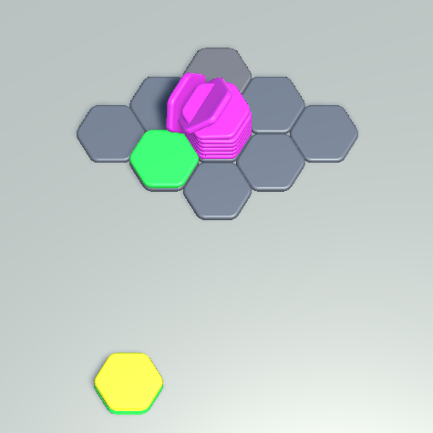

# Cơ chế:
- Tự xây dựng và quản lý lưới hexa
- Khi đặt stack có lớp controller xử lý dự kiện và duyệt hàng xóm theo offset để check điều kiện trộn stack
- Thứ tự ưu tiên merge: 
    - Đếm số lượng màu trên 1 cell và trộn vào cell có ít màu hơn
    - Nếu số lượng màu trên 1 cell bằng nhau thì trộn vào cell có ít hexa trên đỉnh hơn
    - Nếu số lượng hexa trên đỉnh bằng nhau thì trộn cell có tổng hexa ít hơn
    - Cuối cùng merge vào cell hàng dưới

# Demo
